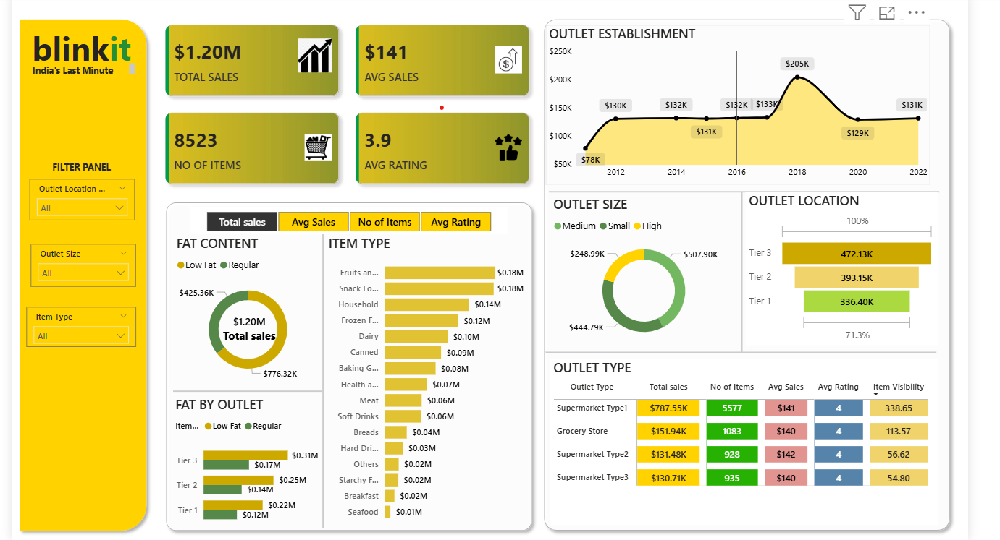
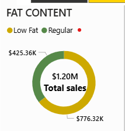

# blinkit-powerbi-project
this is a power BI project.in this i used a sample data to create KPI's and to create a dashboard. 
# 📊 Blinkit Power BI Analysis Project

## 🧠 Project Objective

The aim of this project is to conduct a comprehensive analysis of Blinkit's sales performance, customer satisfaction, and inventory distribution. This analysis helps uncover key insights and optimization opportunities using Power BI's visualizations and KPIs.

---

## 📌 KPI Requirements

The following Key Performance Indicators (KPIs) were used for the analysis:

1. **Total Sales** – The overall revenue generated from all items sold.
2. **Average Sales** – The average revenue per sale.
3. **Number of Items** – The total count of different items sold.
4. **Average Rating** – The average customer rating for items sold.

---

## 📊 Chart Requirements

### 1. Total Sales by Fat Content
- **Objective**: Analyze the impact of fat content on total sales.
- **Additional KPI Metrics**: Average Sales, Number of Items, Average Rating.
- **Chart Type**: Donut Chart.

### 2. Total Sales by Item Type
- **Objective**: Identify the performance of different item types in terms of total sales.
- **Additional KPI Metrics**: Average Sales, Number of Items, Average Rating.
- **Chart Type**: Bar Chart.

### 3. Fat Content by Outlet for Total Sales
- **Objective**: Compare total sales across different outlets segmented by fat content.
- **Additional KPI Metrics**: Average Sales, Number of Items, Average Rating.
- **Chart Type**: Stacked Column Chart.

### 4. Total Sales by Outlet Establishment
- **Objective**: Evaluate how the age or type of outlet establishment influences total sales.
- **Chart Type**: Line Chart.

### 5. Sales by Outlet Size
- **Objective**: Analyze the correlation between outlet size and total sales.
- **Chart Type**: Donut / Pie Chart.

### 6. Sales by Outlet Location
- **Objective**: Assess the geographic distribution of sales across different locations.
- **Chart Type**: Funnel Map.

### 7. All Metrics by Outlet Type
- **Objective**: Provide a comprehensive view of all key metrics (Total Sales, Average Sales, Number of Items, Average Rating) broken down by different outlet types.
- **Chart Type**: Matrix Card.

---

## 🛠 Tools Used

- **Microsoft Power BI** – For data modeling, visualization, and dashboard creation.
- **Blinkit Sample Dataset** – Used for analysis and dashboard development.

---

## 📈 Outcome

This project presents an interactive dashboard to help stakeholders understand sales trends and performance drivers, enabling data-driven decisions for better business outcomes.

---

## 📷 Dashboard Screenshots

### 🔹 Main Dashboard View

### 🔹 Sales by Fat Content

### 🔹 Sales by Item Type

---

## 👨‍💼 Author

**G. Revanth Kumar**  
Data Enthusiast & Power BI Developer

---

